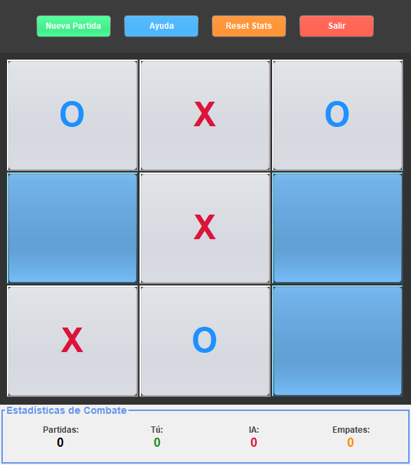
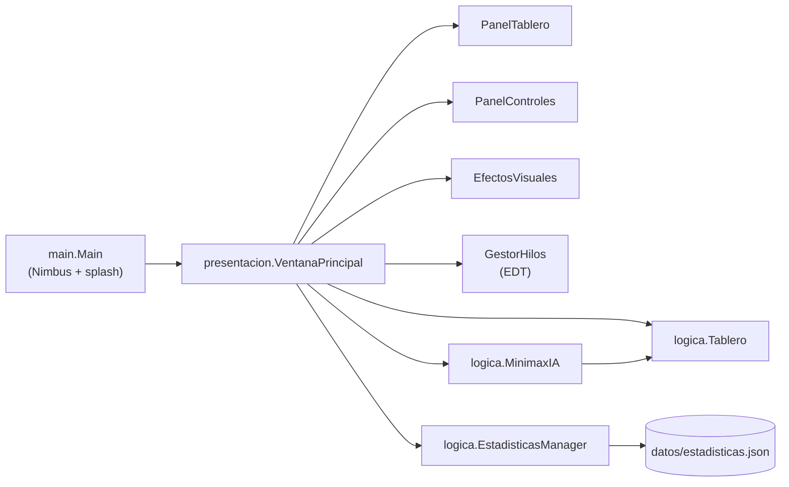

<div align="center">
  
  <h1>TresEnLinea</h1>
  <p><b>Tres en raya de escritorio en Java con una IA Minimax que nunca pierde, verificada sobre todo el árbol de juego.</b></p>
  
  
  
  
  <p>
    <a href="#-inicio-rápido">Inicio rápido</a> ·
    <a href="#-características">Características</a> ·
    <a href="#-arquitectura">Arquitectura</a> ·
    <a href="#-pruebas">Pruebas</a> ·
    <a href="#-lo-que-todavía-no-existe">Limitaciones</a>
  </p>
</div>

TresEnLinea es un tres en raya para un jugador (tú con **X**, la IA con **O**) con interfaz Swing y
estadísticas guardadas en un archivo JSON. Es un ejemplo compacto de Minimax, separación lógica/interfaz y
manejo de hilos en Swing. No tiene modo de dos jugadores ni ajuste de dificultad: la IA siempre juega de
forma óptima, así que lo mejor que puedes lograr es un empate.

## 🎬 Vista rápida

Captura real de una partida en curso (la IA ya respondió a tres jugadas; los datos son de una ejecución de prueba):

<div align="center">
  
</div>

## ✨ Características

| Característica | Detalle |
|:---|:---|
| IA Minimax | Puntuación con profundidad (`10 - profundidad` / `profundidad - 10`): prefiere ganar rápido y perder tarde |
| Invencibilidad verificada | Un test recorre todas las partidas posibles: 569 con el humano primero (386 victorias IA, 183 empates, 0 derrotas) y 73 con la IA primero (71 victorias, 2 empates, 0 derrotas) |
| Turnos protegidos | Mientras la IA "piensa" (retraso de 500 ms) no se acepta un segundo movimiento del jugador |
| Hilos | `GestorHilos` centraliza las actualizaciones de UI en el Event Dispatch Thread |
| Estadísticas en JSON | Partidas, victorias, empates, rachas y fechas en `datos/estadisticas.json`, sin librerías externas |
| Autorreparación | Si el archivo falta, está corrupto, es ilegible o tiene otro esquema, se reinicia con valores por defecto |
| Interfaz | Swing con Nimbus, pantalla de carga de 2 s, efectos de resultado y resaltado de casillas; botones Nueva Partida, Ayuda, Reset Stats y Salir |

## 🏗️ Arquitectura



`logica/` no depende de Swing y se prueba sola; `presentacion/` contiene la interfaz.

<details>
<summary>Estructura de carpetas</summary>

```text
TresEnLinea/
├── pom.xml
├── ejecutar.bat
├── datos/estadisticas.json
├── src/main/java/{main,logica,presentacion}/
├── src/test/java/{logica,presentacion}/
└── .github/workflows/ci.yml
```

</details>

## 🚀 Inicio rápido

| Requisito | Versión |
|:---|:---|
| JDK | 17 o superior (el `pom.xml` compila a 17; probado con un JDK reciente) |
| Maven | Opcional: solo para empaquetar y correr las pruebas |

1. Clona el repositorio:
   ```bash
   git clone https://github.com/Luiss2080/TresEnLinea.git
   cd TresEnLinea
   ```
2. Con Maven (genera `target/tres-en-linea.jar`):
   ```bash
   mvn package
   java -jar target/tres-en-linea.jar
   ```
3. O sin Maven:
   ```bash
   javac -encoding UTF-8 -d bin src/main/java/main/Main.java src/main/java/logica/*.java src/main/java/presentacion/*.java
   java -cp bin main.Main
   ```
   En Windows también sirve `ejecutar.bat`.

Haz clic en una casilla vacía; la IA responde sola. **Nueva Partida** reinicia el tablero y **Reset Stats**
borra el historial.

## 🧪 Pruebas

```bash
mvn test
```

Hay **26 pruebas** JUnit 5 (verificadas localmente con `mvn test`: 26 ejecutadas, 0 fallos): invencibilidad
exhaustiva de la IA (3), reglas del tablero (12), persistencia de estadísticas incluyendo archivo faltante,
corrupto, binario o de otro esquema (7), contrato de hilos (3) y la regresión del doble clic durante el
turno de la IA (1). Las pruebas que crean una ventana Swing se saltan si no hay pantalla (en el CI se usa Xvfb).

## 🚧 Lo que todavía no existe

- Modo de dos jugadores, elección de símbolo o de quién mueve primero: el humano siempre es **X** y siempre empieza.
- Niveles de dificultad: la IA es siempre óptima.
- Tablero mayor de 3×3.
- `datos/estadisticas.json` está versionado con datos de ejemplo y la app lo sobrescribe al jugar (ruta relativa al directorio de ejecución).

## 📄 Licencia

MIT. Consulta [`LICENSE`](LICENSE).

<div align="center"><sub>Hecho por Luiss2080 · Java, Swing y Minimax</sub></div>
